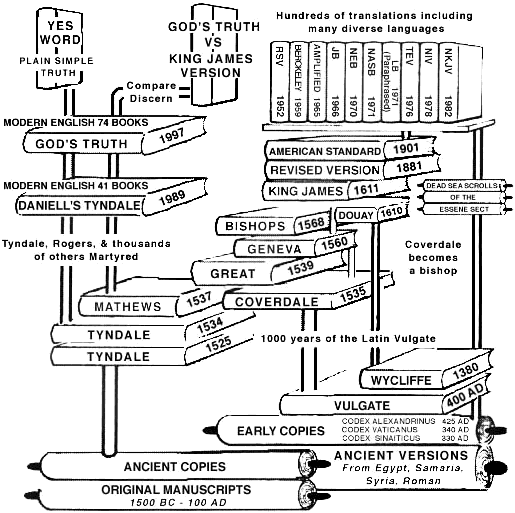
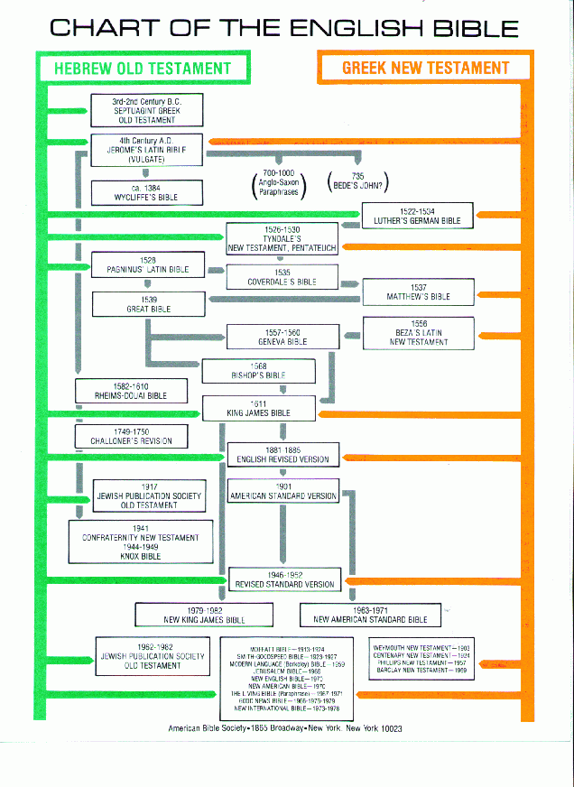

## Traduções da Bíblia ao longo do tempo

| Ano  | Autor da Tradução                                  | Detalhes                                                                                        | Língua Fonte                      |
| ---- | -------------------------------------------------- | ----------------------------------------------------------------------------------------------- | --------------------------------- |
| 1300 | D. Dinis                                           | Primeiras traduções de trechos da Bíblia, incluindo o Gênesis.                                  | Latim (Vulgata)                   |
| 1343 | Monges de Cister                                   | Tradução do livro de Atos dos Apóstolos no Mosteiro de Alcobaça.                                | Latim (Vulgata)                   |
| 1495 | Valentim Fernandes de Morávia e Nicolau de Saxónia | Tradução dos Evangelhos "De Vita Christi".                                                      | Latim (Vulgata)                   |
| 1497 | Rodrigo Álvares                                    | Tradução dos Evangelhos e epístolas.                                                            | Latim (Vulgata)                   |
| 1505 | Frei Bernardo de Brivega                           | Tradução do livro de Atos dos Apóstolos e epístolas.                                            | Latim (Vulgata)                   |
| 1538 | Damião de Góis                                     | Tradução do livro de Eclesiastes, publicada em Veneza.                                          | Latim (Vulgata)                   |
| 1676 | João Ferreira de Almeida                           | Início da tradução do Novo Testamento em português.                                             | Grego e Hebraico                  |
| 1681 | João Ferreira de Almeida                           | Publicação do Novo Testamento traduzido.                                                        | Grego e Hebraico                  |
| 1753 | João Ferreira de Almeida                           | Publicação da Bíblia completa em português, em dois volumes.                                    | Grego, Hebraico e Latim (Vulgata) |
| 1809 | João Ferreira de Almeida                           | Primeiro Novo Testamento da tradução publicado pela Sociedade Bíblica Britânica.                | Grego e Hebraico                  |
| 1819 | João Ferreira de Almeida                           | Primeira impressão da Bíblia completa em um único volume.                                       | Grego, Hebraico e Latim (Vulgata) |
| 1898 | Revisores da Sociedade Bíblica                     | Revisão da tradução de Almeida, conhecida como Almeida Revista e Corrigida (ARC).               | Grego e Hebraico                  |
| 1917 | Comissão de Especialistas                          | Tradução Brasileira, a primeira feita no Brasil.                                                | Grego e Hebraico                  |
| 1932 | Matos Soares                                       | Tradução feita em Portugal a partir do texto latino.                                            | Latim (Vulgata)                   |
| 1956 | Revisores da Sociedade Bíblica                     | Conclusão da revisão da tradução de Almeida, conhecida como Almeida Revista e Atualizada (ARA). | Grego e Hebraico                  |
| 2017 | Sociedade Bíblica do Brasil                        | Lançamento da Nova Almeida Atualizada.                                                          | Grego e Hebraico                  |
| 2019 | CEP (Comissão Evangélica Portuguesa)               | Lançamento "Os Quatro Evangelhos e Salmos", traduzido diretamente dos idiomas originais.        | Grego e Hebraico                  |

Essa tabela resume as principais traduções da Bíblia para o português ao longo dos séculos, destacando os tradutores e os contextos históricos relevantes.

### Imagens sobre a linha do tempo da Bíblia

![[manuscritos biblicos.svg|manuscritos biblicos.svg]]

![[History_of_BT.png|800]]

### Referências

- [A Bíblia em Português - www.sbb.org.br](https://www.sbb.org.br/historia-da-biblia-sagrada/a-biblia-em-portugues)
- [Traduções (Cronológicas) - Bíbliateca Teológica](https://bibliateca.com.br/site/a-biblia-em-portugues/traducoes-em-ordem-cronologica)
- [Escrituras Sagradas: a breve história da Bíblia e suas traduções](https://globaltranslations.com.br/escrituras-sagradas-a-breve-historia-da-biblia-e-suas-traducoes/)
- [Traduções da Bíblia em língua portuguesa – Wikipédia, a enciclopédia livre](https://pt.wikipedia.org/wiki/Tradu%C3%A7%C3%B5es_da_B%C3%ADblia_em_l%C3%ADngua_portuguesa)
- [Tradução da Bíblia – Wikipédia, a enciclopédia livre](https://pt.wikipedia.org/wiki/Tradu%C3%A7%C3%A3o_da_B%C3%ADblia)
- [Versões da Bíblia Almeida – Qual a diferença e como escolher](https://armazemdabiblia.pt/pt/noticias/versoes-da-biblia-almeida-and-ndashqual-a-diferenca-e-como-escolher)
- [A brief history of Bible translation - Wycliffe Bible Translators](https://wycliffe.org.uk/story/a-brief-history-of-bible-translation)
- [God's Truth: History of the Recorded Word of God](https://www.godstruthtous.com/documentation/history_bookgraph.htm)
- [Manuscritos - Luiz Sayão - IBNU - YouTube](https://www.youtube.com/watch?v=RDCQombCuGw)
- #Teologia 
