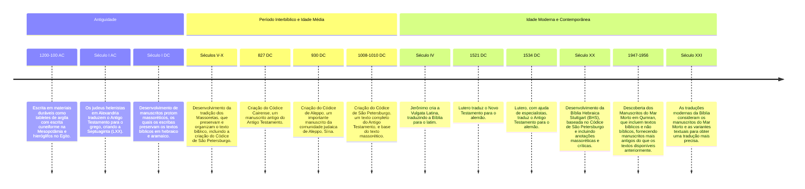

## Manuscritos Bíblicos

![[manuscritos biblicos.svg|manuscritos biblicos.svg]]

Fonte: [Aula 1 - Manuscritos - Luiz Sayão - IBNU - YouTube](https://www.youtube.com/watch?v=RDCQombCuGw&list=PLl90RweiCeJyH1CCf8Hy2rLfQ_MhUUIjP&index=1)

%%


# Excalidraw Data

## Text Elements

## Drawing
```compressed-json
N4KAkARALgngDgUwgLgAQQQDwMYEMA2AlgCYBOuA7hADTgQBuCpAzoQPYB2KqATLZMzYBXUtiRoIACyhQ4zZAHoFAc0JRJQgEYA6bGwC2CgF7N6hbEcK4OCtptbErHALRY8RMpWdx8Q1TdIEfARcZgRmBShcZQUebQAObQAGGjoghH0EDihmbgBtcDBQMBKIEm4IAEYAdnwATQAZAHlmHga4AC14pIBVADMADQARfQBhACUYVJLIWEQKwn1opH5S

zG5nbqTkgE4dgDYeJP34ncqAFiTK1cgptGcAZgfz7QBWc8r914edpOPz/bVG4QCgkdTcT5/bSVPY8D4ParxHjdPiFSCSBCEZTSbj7fY7ZLxJ5JRFXHg7Z7A6zKYLcJLA5hQUhsADWCFGbHwbFIFSZ1mYcFwgWy01Kmlw2BZymZQg4xA5XJ5Ej5HAFQqyUFFkD6hHw+AAyrBaRJBB4tRBGcy2QB1MGSbiomYWpmshCGmDG9Cm8rAmXYjjhXJoa5oi

BsQXYNR3VCVP7A6XCOAASWIQdQeQAusC+uRMinuBwhHrgYQ5VgKrgUr7hHKA8w04Xi6GwghiNxzjtzucHoC8cDGCx2Fw0Od+0xWJwAHKcMQQnbVSoPV6Lw4l5hDdJQVvcPoEMLAzQ14gAUWCmWyaczwKEcGIuC3beD1SXROer0OJOBRA4LILRfwX5sJK25oLu+D7qG2BCIyBhDPeuDcMUTqZKQSwkAAKlgmrKosQSlggAA6HCoCRREkSRYTYFAQ6

oAAgtkWJCCQuDEIRxHkWR5GVEcSTOLGSR0aMaDHsw2CkGouCoBkqBLFu4m4IQzCoMQIgAIeMIpqB6PobCoFEmjBFuSmsagQqqPgknaVJoniVEWmypifTcpkqAcJJACy4ThmwUAAEf6FYUmoJIhBMAAzzShBOUpHC6ceqhQGw2iceRHHsSR+oAJdQVyqBJoJaAtKgABWQisdBwXpBwilREp0m0cEmDWGQgV8ipRjSbp9HUcoumYYyuDnolqCCuQqC

6dKCC9dQWnyXKumSfqCBwFAQjRKWdkABQNAMAwAJTJelqWoClqBZTlun5UMQmoBuYQcPQnJmENukmUshY2WobBKXAzKJfoMmhIIpCZdRejMDN32oAAjmtmlQ+EYmEOKP2BGEpD0IN41KVumCJUpmgALcGeYCMAximjkKTQVCoNCl6Idp2nZR1GcKgAAKTCE2wxCXdkTBEyTehBSmLEIKg7mZY4uCncdp3nUWUMAGrOAMaB3Vkj34M9GqvZJbWEAA

5wAx69UPuUD3IILVM2w+Lv3hEwmMA+L3LKNYhBGFjum48NgtEHoM2ltgvilrzpmzVYJtm6goxhY4YjKeL+qmxz1vjpoIi9Ydx1palSLVLdN2jPJ0fKbpccJ+LowKcK+6oEIAPvdBSPDdYPUx91WJ9eEUQvTnucnUdFICddaAl1Hqfh5X5jiyZDXLXAbAzY3qCLEvpBRPzgMfa3etaQYsrMSZpV3uYknz8EcBLzN+qE/JA+56d/HxHxVyj8XpdTxX

8ez0nZ2p05nJZgmdSDTQbgDX2ultI+Gtp3BivVUD9T7rrGa4sUZzx9lhXSSx6zclBqTR+Q9UosxoqLEy7keZMDckFDk/N9Ab18gGGWR15bZUVnlJWaAABSTAAAv1UdKR0kpJJWRZ3Z2QaPeUsuAZptSEJYeaEcABCxMiCSVGpJXSFlqL6CIalZ+rweCVCLmgBoQg5I+3IO1caqBpyPSQb3QausRq01sQQDIpsiGGOeKY1A5jLEzSsrgU+F9xbhEQ

JGAgNVQhyOsQo2xXdEHIOcdkXSmj3Fni8UzI6Ctcq7XVo7B6T1cJpOUpJVRJNJIAAkECU3potVaMh3ab1QJtZR1T9R7RmhgliklYqx1/onEyKddJAIzlnXS4tg6hyUdYHyuBDYAFfwiAzwSDMGoQgpiUJps5gj9n6dmqHxHY75CmiTsEwOyvMlIW13rZKG4cLakAltyYa0kACKjdyAcFtkIaZHAQ7/MgdggmajSZ1Vcqnf2EKZpOVIAGMQSjm6fX

xoDTS7du7GV0nbbGelQXKUUkvDghMNJKXbkwdgqENQIAObk9h+SBhJjQLRHG8TlmrJ0qxBFWy7yoEqeog+qoSBMG9kpFFe9sUSyFK8zeUzTJKUxnNIy+K8Zwx+m4uwckIH63ZanNCqMECRmYLgbQEA0QAF8GRRFWmmC0uBGBtmzLqBA+YJBJGwIydy+xCBK0qB8ow1QeADFGBQTy+h9j6nNKJDx+Q0RgBDDMBNaIsyQWZHAP8epCgWvAKmyAuBr6

GnvOIVASFoAYkyBUIg2JNSrAYKFCgyiJRShlHKBU3IKgAGI+g9t7aKCAUFSDCigEmLc+hDRWnZJyDtEhO2VAQPO+d/bB3DtHRkJtkoEyynlNOpU6AVRqmHcukQq6x0ADFdQGiNCWi0nIfSFAHSejUa7x0uhtHaB0daV3PrHRO107pPS3rNF+p92QX3jGEP6QMEIQNDp/RkJoEYowQjjA+79YHz2cCgGewaupoyJsgOhkdmHsj6k9iWo4sHT0ZEwn

jBqWJhzoGCH0WtaHQPEYyEWzetEh1sAoBiFimaAJsbgxhjIx45Q8eZPxkIj50BCmk8e0THH9BSb4+heAN7W1OofTZTk+ABjcHiN2aErx3xHHJK8bo8R4h1r03qOo3BqjVBeNUV4Ox4jPjhPsSopwgQPqMGwAwiFQyY18CW7YHYeDGPONmqj8H9AQe3XWO12n+3ShIGRjqDp6QPoy8QQ0y1uCvDrflyhrEJO4AMiBVAYEIKlHy+2vdSFIDKM5HJiA

YDxSbWMUCXgNQZq9ZmtsV4e1zTjCmkWIUFQuu4B6w8ekvAFuDeW6gEbY24sieHX+tkiHWaqiE3WnMziJtlnEhwZQIWnRZCq8EOTTJ/nAhDoQDNaAHsIGBG5Stb3SCPdDMIKA34S3vc26UOwxUjU5H1G5OA5WECVeq3JurH2H0SmoowdCQX8BXdKHMG9YRghUSHOaKCMF9AafmGgRswmnRcmAkjvcKPaehCgLRInGOsdCezeAK1dAdTBDTMAHNFqg

A===
```
%%